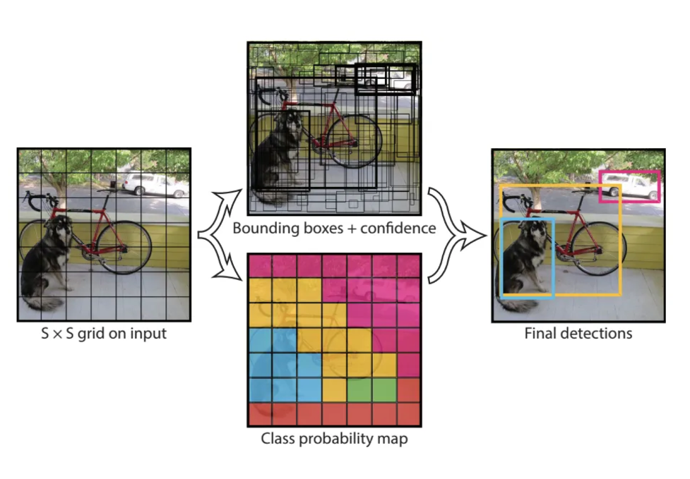
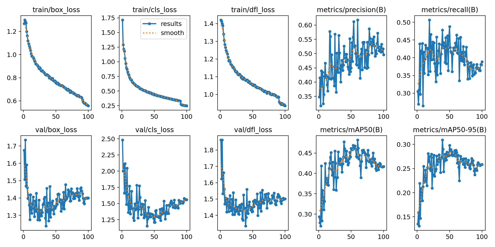
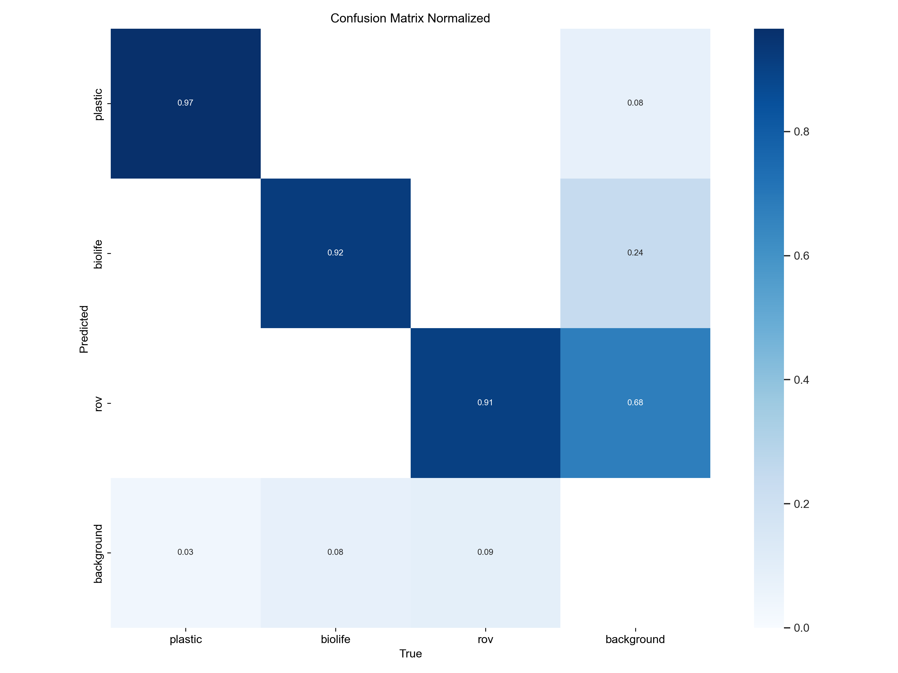
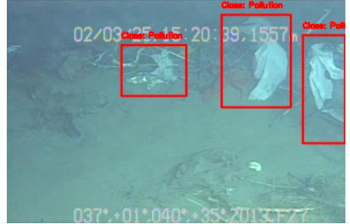
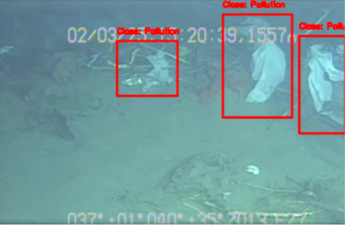
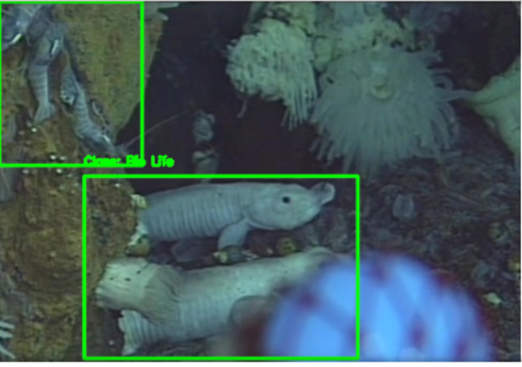
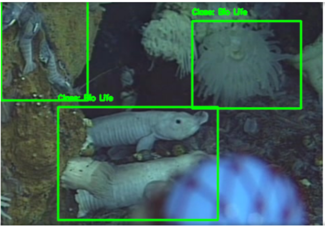

# Leveraging ML to scale Plastic Pollution Cleanup in Water Bodies

This study demonstrates on how Machine Learning technology can be used to help in detecting plastic in water bodies using satellite and drone images, so that cleanup efforts are deployed in right location with right resources.

*Object detection* is a deep learning approach which localizes and simultaneously classify different objects present in a digital image. Object detection technique draws bounding boxes on the objects and also categorize the class of such objects at the same time. Object detection technique will best suitable for this study because the goal is to identify the exact location of plastic waste only if present in digital images.

### Datasets

The dataset identified for this study is taken from [Data Repository][1] for the University of Minnesota (DRUM).  The dataset contains images of various different kinds of marine debris that are captured from real underwater environments where the objects are in different states of decay, occlusion, and overgrowth. The images are labeled with bounding boxes on instances of trash, biological objects such as plants and animals, and ROVs (Fulton et al., 2020).

[1]:https://conservancy.umn.edu/handle/11299/214366

### Approach
YOLO (You Only Look Once) is a state-of-the-art, real-time object detection deep learning architecture in which a single convolutional network detects the bounding boxes and class probabilities of these boxes. It divides image into grid of cells and the network predicts the class probability, bounding boxes and confidence score for each cell. Then Non-max Suppression filtering algorithm is used to select only relevant probabilities to finalize the class or classes based on confidence threshold. 

### Training

The training and validation are very promising with high . The model training and validation plots show that setting a confidence threshold of `0.6` can achieve more than `85%` precision and greater than `70% `recall with F1 score of about `0.8`. The mAP(mean average precision) curve show that the training achieved a maximum of `44.7` mAP at `0.5` confidence (Figure 9) threshold which is very promising when compared with the standard mAP of YOLOv8s model for COCO dataset which is `44.9`. 

### Results

The model performed very well when validations were executed with unseen images from test dataset. Precision, Recall and mAP are all high (>90%) for plastics which demonstrates that the model can detect plastics in images with high accuracy. 

Given below are some example which show that the trained model is able to detect plastics and objects very well as present in the ground truth images. It is interesting to notice the trained model even captured the bioife object missed in the original labelled image (refer second image).

_Original Labelled image_

_Deteted Bounding Boxes by Trained Model_

_Original Labelled image_

_Deteted Bounding Boxes by Trained Model_

